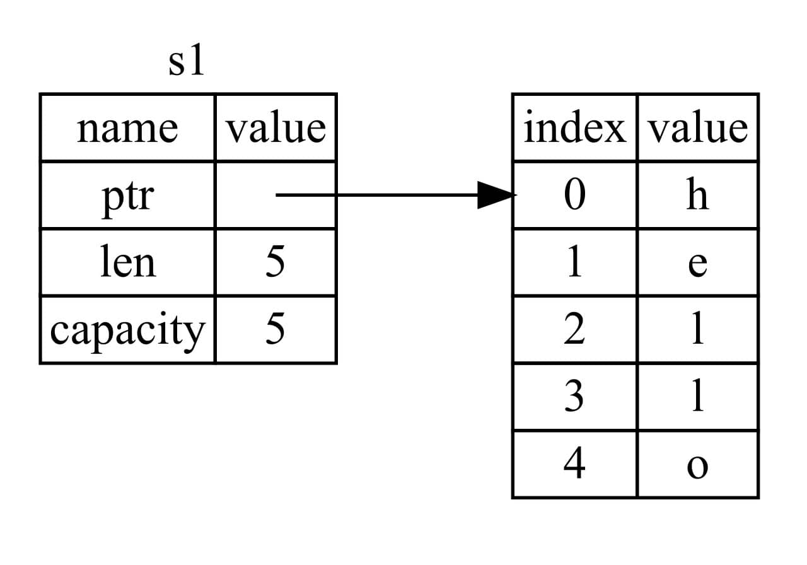

# Ownership

Ownership（所有权）让 Rust 无需 GC 即可保障内存安全，它的存在就是为了**管理堆数据**。

## 1. 什么是所有权

Rust 通过所有权系统管理内存，编译器在编译时会根据一系列的规则进行检查。在运行时，所有权系统的任何功能都不会减慢程序。

## 2. 栈与堆

栈和堆都是代码在运行时可供使用的内存，但是它们的结构不同。

- 栈中的所有数据都必须占用已知且固定的大小。在编译时大小未知或大小可能变化的数据，要改为存储在堆上。
- 堆是缺乏组织的：当向堆放入数据时，要请求一定大小的空间。操作系统在堆的某处找到一块足够大的空位，把它标记为已使用，并返回一个表示该位置地址的 **指针**（*pointer*）。

所有权的作用：

- 跟踪哪部分代码正在使用堆上的哪些数据，最大限度的减少堆上的重复数据的数量。
- 清理堆上不再使用的数据确保不会耗尽空间。

一旦理解了所有权，就不需要经常考虑栈和堆了。

## 3. 所有权的规则

规则：

- Rust 中的每一个值都有一个被称为其 **所有者**（*owner*）的变量。
- 值在任一时刻有且只有一个所有者。
- 当所有者（变量）**离开作用域**，这个值将被丢弃。

## 4. 变量作用域（scope）

用域是一个项（item）在程序中有效的范围。假设有这样一个变量：

```rust
let s = "hello";
```

变量 `s` 绑定到了一个字符串字面值，这个字符串值是硬编码进程序代码中的。这个变量从声明的点开始直到当前 **作用域** 结束时都是有效的。

```rust
{
    // s 在这里无效, 它尚未声明
    let s = "hello"; // 从此处起，s 是有效的

    // 使用 s
} // 此作用域已结束，s 不再有效
```

这里有两个重要的时间点：

- 当 `s` **进入作用域** 时，它就是有效的。
- 这一直持续到它 **离开作用域** 为止。

到目前为止，变量是否有效与作用域的关系跟其它编程语言是类似的。

## 5. String

字符串字面值，即被硬编码进程序里的字符串值，它并不适合于使用文本的每一种场景：

- 它们是不可变的。
- 并非所有字符串的值都能在编写代码时就知道，比如获取用户输入并存储。

Rust 有第二个字符串类型 String，这个类型被分配到堆上，所以能够存储在编译时未知大小的文本。

示例：

```rust
let mut s = String::from("hello");

s.push_str(", world!"); // push_str() 在字符串后追加字面值

println!("{}", s); // 将打印 `hello, world!`
```

`String` 可变而字面值却不行的原因在于两个类型对内存的处理上。

## 6. 内存与分配

对于 `String` 类型，为了支持一个可变的文本片段，需要在堆上分配一块在编译时未知大小的内存来存放内容。这意味着：

- 必须在运行时向操作系统请求内存。
- 需要一个当处理完 `String` 时，将内存返回给操作系统的方法。

对于第一条，当调用 `String::from` 时，它的实现会请求其所需的内存。而第二条，由于 Rust 没有 GC，需要识别出不再使用的内存并调用代码显式释放它，跟请求内存时一样。

相对于为一个 `allocate` 配对一个 `free` 这样的精确操作，Rust 采取了一个不同的策略：一旦拥有内存的变量离开作用域，内存就会自动释放。

```rust
#![allow(unused)]
fn main() {
    {
        let s = String::from("hello"); // 从此处起，s 是有效的

        // 使用 s
    } // 此作用域已结束，
      // s 不再有效
}
```

当变量离开作用域，Rust 会调用一个特殊的函数，这个函数叫做 `drop`。在其它语言中，本来需要开发者把释放内存的代码放在这个位置，而在 Rust 中，它会在右 `}` 处自动调用 `drop`。

这个模式对编写 Rust 代码的方式有着深远的影响。在更复杂的场景下代码的行为可能是不可预测的，比如当有多个变量使用在堆上分配的内存时。

### 6.1 变量与数据交互的方式 1：移动

Rust 中的多个变量可以采用一种独特的方式与同一数据交互。

```rust
let x = 5;
let y = x;
```

这个例子中，将值 `5` 绑定到 `x`；接着将 `x` 中的值拷贝一份并绑定到 `y`。现在有了两个变量 x 和 y，由于整型是已知的且有固定大小的简单值，这两个 5 被压入栈中。

接下来看一下 String 版本：

```rust
let s1 = String::from("hello");
let s2 = s1;

println!("s1 is: {}", s1);
```

这与上面例子看起来很像：第二行复制了 s1 中的值并将其绑定到 s2。

但事实却不是这样，看一下底层实际发生了什么：

1) String 由三部分组成，而且这一组数据存储在栈上：

- 指针：指向存放字符串内容的内存。
- 长度：String 的内容当前使用了多少字节的内存。
- 容量：String 从操作系统总共获取了多少字节的内存。



图的右侧则是堆上存放内容的内存部分。

当将 s1 赋值给 s2，**String 的数据**被复制了，这意味着**从栈上拷贝了它的指针、长度和容量**，并没有复制指针指向的堆上数据。

如下图所示：


Rust 并没有将 ptr 指针指向的堆上的数据也拷贝一份，因为这样的话，如果堆上的数据比较大，操作 `s2 = s1` 会对运行时性能造成非常大的影响。

前面提到过，当变量离开作用域后，Rust 会自动调用 `drop` 函数并清理变量的堆内存。不过如上图所示，两个数据指针指向了同一位置，这就有了一个问题：当 `s2` 和 `s1` 离开作用域，他们都会尝试释放相同的内存。这是一个叫做 **二次释放**（*double free*）的错误，属于内存安全性 bug。

为了确保内存安全，这种场景下 Rust 是处理的：与其尝试拷贝被分配的内存，Rust 则认为 `s1` 不再有效，因此 Rust 不需要在 `s1` 离开作用域后清理任何东西。

执行上面的代码，会报错，因为 Rust 禁止使用无效的引用。：

```bash
error[E0382]: borrow of moved value: `s1`
 --> src/main.rs:5:27
  |
2 |     let s1 = String::from("hello");
  |         -- move occurs because `s1` has type `String`, which does not implement the `Copy` trait
3 |     let s2 = s1;
  |              -- value moved here
4 |
5 |     println!("s1 is: {}", s1);
  |                           ^^ value borrowed here after move
```

Rust 中拷贝指针、长度和容量而不拷贝数据类似于其它语言中的浅拷贝，但 Rust **使第一个变量失效了**，这个操作被称为 **移动**（*move*），而不是浅拷贝。

上面的例子可以解读为 `s1` 被 **移动** 到了 `s2` 中，如图所示：


这样就解决了二次释放的问题，因为只有 `s2` 是有效的，当其离开作用域，只有它释放自己的内存。

另外，这里还隐含了一个设计选择：Rust 永远也不会自动创建数据的 “深拷贝”。因此，任何 **自动** 的复制可以被认为对运行时性能影响较小。

### 6.2 变量与数据交互的方式 2：克隆

如果 **确实** 需要深拷贝 `String` 中堆上的数据，而不仅仅是栈上的数据，可以使用一个叫做 `clone` 的通用函数。

```rust
fn main() {
    let s1 = String::from("hello");
    let s2 = s1.clone();

    println!("s1: {}, s2: {}", s1, s2);
}
```

当使用 `clone` 调用时，一些特定的代码被执行，而且这些代码可能相当消耗资源。

### 6.3 只在栈上的数据：拷贝

像整型这样的**在编译时已知大小的类型**被整个存储在栈上，所以拷贝其实际值是很快的，所以无需在创建变量 `y` 后使 `x` 无效。

Rust 有一个叫做 `Copy` trait 的特殊注解，可以用在类似整型这样的存储在栈上的类型上。关于它有如下规则：

- 如果一个类型实现了 `Copy` trait，旧的变量在赋值后仍然可用。
- Rust 不允许自身或其任何部分实现了 `Drop` trait 的类型使用 `Copy` trait。
- 如果对其值离开作用域时需要特殊处理的类型使用 `Copy` 注解，将会出现一个编译时错误。

那么什么类型是 `Copy` 的呢？任何简单标量值的组合可以是 `Copy` 的，不需要分配内存或某种形式资源的类型是 `Copy` 的，下面是一些 `Copy` 的类型：

- 所有整数类型。
- 布尔类型 `bool`。
- 所有浮点数类型。
- 字符类型，`char`。
- 元组，当且仅当其包含的类型也都是 `Copy` 的时候。比如，`(i32, i32)` 是 `Copy` 的，但 `(i32, String)` 就不是。

## 7. 所有权与函数

**将值传递给函数在语义上与给变量赋值相似**。向函数传递值可能会移动 (move) 或者拷贝 (copy)，就像赋值语句一样。

看下面的带有所有权和作用域注释的示例：

```rust
fn main() {
    let s = String::from("hello");  // s 进入作用域

    takes_ownership(s);             // s 的值 move 到函数中,
                                    // ... 所以在这里不再有效

    let x = 5;                      // x 进入作用域

    makes_copy(x);                  // x 会 move 到函数中,
                                    // 但 i32 是 Copy 的, 所以后面还是可以用 x

} // 这里, x 先移出了作用域, 随后是 s. 但因为 s 的值已被 move 了，无事发生

fn takes_ownership(some_string: String) { // some_string 进入作用域
    println!("{}", some_string);
} // 这里, some_string 移出作用域并且 `drop` 被调用, 数据在堆上占用的内存被释放了.

fn makes_copy(some_integer: i32) { // some_integer 进入作用域
    println!("{}", some_integer);
} // 这里, some_integer 移出作用域. 无事发生.
```

当尝试在调用 `takes_ownership` 后使用 `s` 时，Rust 会抛出一个编译时错误。

## 8. 返回值和作用域

返回值也可以转移所有权。看下面的例子：

```rust
fn main() {
    let s1 = gives_ownership();         // gives_ownership 移动它的返回值到 s1

    let s2 = String::from("hello");     // s2 进入作用域

    let s3 = takes_and_gives_back(s2);  // s2 被移动到 takes_and_gives_back, 
                                        // takes_and_gives_back 也将其返回值移动到 s3
} // 这里, s3 移出作用域并被 drop, s2 移出了作用域但是已经被移动了, 因此无事发生. s1 移出作用域而且被 drop 了.

fn gives_ownership() -> String {             // gives_ownership 将它的返回值移动到调用它的函数中

    let some_string = String::from("hello"); // some_string 进入作用域

    some_string                              // some_string 返回并移动到调用的函数
}

// takes_and_gives_back 将接受一个 String 并返回一个
fn takes_and_gives_back(a_string: String) -> String { // a_string 进入作用域
    a_string  // a_string 返回并移动到调用函数
}
```

变量的所有权总是遵循相同的模式：

- 将值赋给另一个变量时移动它。
- 当持有堆中数据值的变量离开作用域时，其值将通过 `drop` 被清理掉，除非数据被移动为另一个变量所有。

如果想要函数**使用一个值但不获取所有权**该怎么办呢？如果还要接着使用它的话，每次都传进去再返回来会很繁琐，除此之外，也可能想返回函数体中产生的一些数据。

可以使用元组返回多个值：

```rust
fn main() {
    let s1 = String::from("hello");

    let (s2, len) = calculate_length(s1);

    println!("The length of {} is {}.", s2, len);
}

fn calculate_length(s: String) -> (String, usize) {
    let length = s.len();

    (s, length)
}
```

但对于这种很普遍使用的概念来说，这个操作有点太费劲了。幸运的是，Rust 对此提供了一个特性，叫做 **引用**（*references*）。

## 9. 总结

这小节主要学了 Rust 里面特有的概念，所有权。

- String 是个类似 Go 中的 slice 的复合结构，而且数据是存储在堆上的。它不是可 Copy 的，赋值给另一个变量时，所有权也被转移。
- 当变量离开其作用域，会自动触发 drop 函数，将堆上分配的内存返回给操作系统。
- 移动与拷贝：
  - 对于简单的值类型，由于是分配在栈上，直接拷贝的话消耗也不大，所以无需移动所有权。旧变量赋值给另一个变量后仍可用。
  - 对于非 Copy 的类型（如 String），将值赋值给另一个变量时，发生了所有权的移动，原变量失效。
- 移动 (move) 的好处：
  - 无需深拷贝一份数据，而是直接使旧变量失效，性能较高。
  - 这个特性同时解决了内存二次释放的问题。
- 向函数传递值可能引发拷贝或移动，取决于参数的类型。
- 函数返回的值也可以转移所有权。

